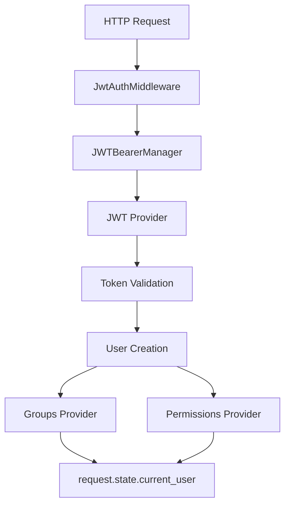

# Auth Middleware

[](https://badge.fury.io/py/auth-middleware)
[](https://www.python.org/downloads/)
[](https://opensource.org/licenses/MIT)
[](https://github.com/impalah/auth-middleware)

**Async Authentication and Authorization Middleware for FastAPI/Starlette Applications**

Auth Middleware is a comprehensive, production-ready authentication and authorization solution for FastAPI and Starlette applications. It provides a pluggable architecture that supports multiple identity providers and authorization backends with async-first design principles.

## Features

### **Authentication Providers**

- **AWS Cognito** - Full integration with Amazon Cognito User Pools
- **Azure Entra ID** - Microsoft Azure Active Directory authentication
- **Generic JWT** - Support for any JWT-based identity provider
- **Custom Providers** - Extensible architecture for custom authentication

### **Authorization & Access Control**

- **Group-based Authorization** - Role-based access control with user groups
- **Permission-based Authorization** - Fine-grained permission system
- **SQL Backend Support** - PostgreSQL and MySQL for groups/permissions storage
- **Cognito Groups Integration** - Direct integration with AWS Cognito groups
- **Custom Authorization Providers** - Build your own authorization logic

### **Performance & Reliability**

- **Async-First Design** - Built for high-performance async applications
- **JWKS Caching** - Intelligent caching of JSON Web Key Sets
- **Connection Pooling** - Efficient database and HTTP connections
- **Lazy Loading** - User groups and permissions loaded on-demand
- **Error Resilience** - Graceful degradation on provider failures

### **Developer Experience**

- **Type-Safe** - Full TypeScript-style type hints throughout
- **FastAPI Integration** - Native dependency injection support
- **Middleware Pattern** - Standard ASGI middleware implementation
- **Environment Configuration** - 12-factor app configuration support
- **Comprehensive Documentation** - Detailed guides and API reference

## Installation

### Using pip

```bash
pip install auth-middleware
```

### Using poetry

```bash
poetry add auth-middleware
```

### Using uv (recommended)

```bash
uv add auth-middleware
```

## Quick Start

### Basic FastAPI Setup

```python
from fastapi import FastAPI, Depends, Request
from auth_middleware import JwtAuthMiddleware
from auth_middleware.functions import require_user, require_groups
from auth_middleware.providers.authn.cognito_provider import CognitoProvider
from auth_middleware.providers.authn.cognito_authz_provider_settings import CognitoAuthzProviderSettings

app = FastAPI()

# Configure authentication provider
auth_settings = CognitoAuthzProviderSettings(
    user_pool_id="us-east-1_abcdef123",
    user_pool_region="us-east-1",
    jwt_token_verification_disabled=False,
)

# Add authentication middleware
app.add_middleware(
    JwtAuthMiddleware,
    auth_provider=CognitoProvider(settings=auth_settings),
)

# Protected endpoint - requires valid authentication
@app.get("/protected", dependencies=[Depends(require_user())])
async def protected_endpoint(request: Request):
    user = request.state.current_user
    return {
        "message": f"Hello {user.name}",
        "user_id": user.id,
        "email": user.email
    }

# Role-based endpoint - requires specific groups
@app.get("/admin", dependencies=[Depends(require_groups(["admin", "moderator"]))])
async def admin_endpoint(request: Request):
    user = request.state.current_user
    groups = await user.groups
    return {
        "message": "Admin access granted",
        "user_groups": groups
    }
```

### Azure Entra ID Setup

```python
from auth_middleware.providers.authn.entra_id_provider import EntraIdProvider
from auth_middleware.providers.authn.entra_id_provider_settings import EntraIdProviderSettings

# Configure Azure Entra ID
entra_settings = EntraIdProviderSettings(
    tenant_id="your-tenant-id",
    client_id="your-client-id",
    issuer="https://sts.windows.net/your-tenant-id/",
)

app.add_middleware(
    JwtAuthMiddleware,
    auth_provider=EntraIdProvider(settings=entra_settings),
)
```

### Generic JWT Provider

```python
from auth_middleware.providers.authn.jwt_provider import JWTProvider
from auth_middleware.providers.authn.jwt_provider_settings import JWTProviderSettings

# Configure generic JWT provider
jwt_settings = JWTProviderSettings(
    secret_key="your-secret-key",
    algorithm="HS256",
    issuer="your-issuer",
)

app.add_middleware(
    JwtAuthMiddleware,
    auth_provider=JWTProvider(settings=jwt_settings),
)
```

## Configuration

### Environment Variables

Configure the middleware using environment variables:

```bash
# Core middleware settings
AUTH_MIDDLEWARE_DISABLED=false
AUTH_MIDDLEWARE_LOG_LEVEL=INFO

# JWKS caching configuration
AUTH_MIDDLEWARE_JWKS_CACHE_INTERVAL_MINUTES=20
AUTH_MIDDLEWARE_JWKS_CACHE_USAGES=1000

# AWS Cognito settings (if using Cognito provider)
COGNITO_USER_POOL_ID=us-east-1_abcdef123
COGNITO_USER_POOL_REGION=us-east-1

# Azure Entra ID settings (if using Entra ID provider)
AZURE_TENANT_ID=your-tenant-id
AZURE_CLIENT_ID=your-client-id
AZURE_CLIENT_SECRET=your-client-secret

# JWT settings (if using generic JWT provider)
JWT_SECRET_KEY=your-secret-key
JWT_ALGORITHM=HS256
JWT_ISSUER=your-issuer
```

### Advanced Configuration with Groups and Permissions

```python
from auth_middleware.providers.authz.sql_groups_provider import SqlGroupsProvider
from auth_middleware.providers.authz.sql_permissions_provider import SqlPermissionsProvider

# Setup with database-backed authorization
auth_provider = CognitoProvider(
    settings=auth_settings,
    groups_provider=SqlGroupsProvider(),
    permissions_provider=SqlPermissionsProvider(),
)

app.add_middleware(JwtAuthMiddleware, auth_provider=auth_provider)

# Use permission-based authorization
from auth_middleware.functions import require_permissions

@app.post("/admin/users", dependencies=[Depends(require_permissions(["user.create", "user.manage"]))])
async def create_user(request: Request):
    user = request.state.current_user
    permissions = await user.permissions
    return {"message": "User creation allowed", "permissions": permissions}
```

## Usage Examples

### Making Authenticated Requests

```bash
# Get JWT token from your identity provider, then:
curl -H "Authorization: Bearer YOUR_JWT_TOKEN" \
     http://localhost:8000/protected
```

### Accessing User Information

```python
@app.get("/profile")
async def get_profile(request: Request):
    user = request.state.current_user

    return {
        "id": user.id,
        "name": user.name,
        "email": user.email,
        "groups": await user.groups,
        "permissions": await user.permissions
    }
```

### Custom Authorization Logic

```python
from auth_middleware.functions import require_user

@app.delete("/posts/{post_id}")
async def delete_post(post_id: str, request: Request, _: None = Depends(require_user())):
    user = request.state.current_user
    post = await get_post(post_id)

    # Custom authorization logic
    user_groups = await user.groups
    if post.owner_id != user.id and "admin" not in user_groups:
        raise HTTPException(status_code=403, detail="Not authorized to delete this post")

    await delete_post_by_id(post_id)
    return {"message": "Post deleted successfully"}
```

## Documentation

### Core Components

| Component             | Description                                      |
| --------------------- | ------------------------------------------------ |
| `JwtAuthMiddleware`   | Main ASGI middleware for request authentication  |
| `JWTProvider`         | Abstract base for authentication providers       |
| `GroupsProvider`      | Abstract base for group-based authorization      |
| `PermissionsProvider` | Abstract base for permission-based authorization |
| `User`                | Pydantic model representing authenticated users  |

### User Object Properties

The authenticated user is available in `request.state.current_user`:

| Property      | Type               | Description                                   |
| ------------- | ------------------ | --------------------------------------------- |
| `id`          | `str`              | Unique user identifier from identity provider |
| `name`        | `str \| None`      | User's display name                           |
| `email`       | `EmailStr \| None` | User's email address                          |
| `groups`      | `list[str]`        | User groups (async property)                  |
| `permissions` | `list[str]`        | User permissions (async property)             |

### Authorization Functions

| Function                           | Description                                 |
| ---------------------------------- | ------------------------------------------- |
| `require_user()`                   | Ensures user is authenticated               |
| `require_groups(groups)`           | Requires user to be in specified groups     |
| `require_permissions(permissions)` | Requires user to have specified permissions |

## Architecture



## Development

### Setup Development Environment

```bash
# Clone the repository
git clone https://github.com/impalah/auth-middleware.git
cd auth-middleware

# Create virtual environment and install dependencies
make venv

# Run tests
make test

# Run type checking
make type-check

# Run linting
make lint

# Run all quality checks
make check
```

### Build and Release

```bash
# Build package
make build

# Publish to PyPI
make publish

# Build Docker image
make docker-build
```

## Contributing

We welcome contributions! Please see our [Contributing Guide](CONTRIBUTING.md) for details.

1. Fork the repository
2. Create a feature branch (`git checkout -b feature/amazing-feature`)
3. Commit your changes (`git commit -m 'Add amazing feature'`)
4. Push to the branch (`git push origin feature/amazing-feature`)
5. Open a Pull Request

## License

This project is licensed under the MIT License - see the [LICENSE](LICENSE) file for details.

## Links

- **Documentation**: [Full documentation and guides](https://auth-middleware.readthedocs.io/)
- **PyPI Package**: [https://pypi.org/project/auth-middleware/](https://pypi.org/project/auth-middleware/)
- **Source Code**: [https://github.com/impalah/auth-middleware](https://github.com/impalah/auth-middleware)
- **Bug Reports**: [GitHub Issues](https://github.com/impalah/auth-middleware/issues)

## Credits

Created by [impalah](https://github.com/impalah)

---

**Made for modern Python async applications**
